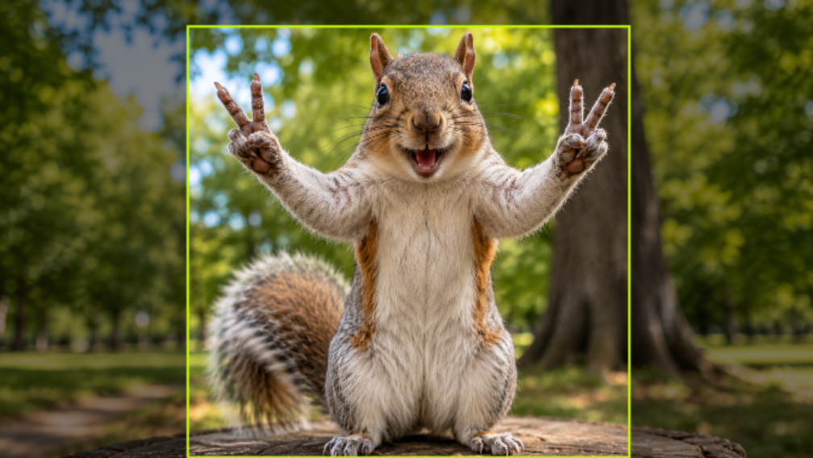
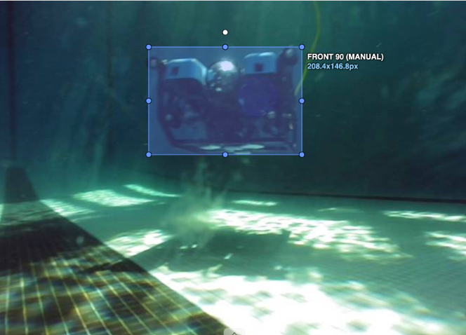
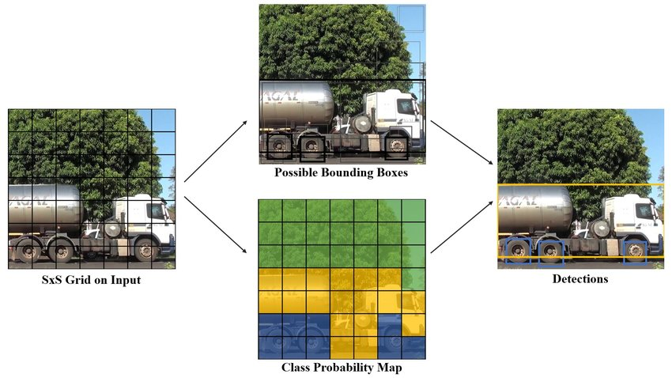
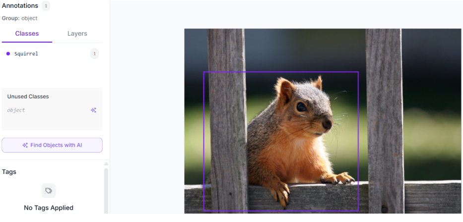

# Welcome to Object Detection!

  
    Viktor Osadsky
  

---

# How can we make robots see?

..................

The solution is:

**Object Detection**

This is the process of a computer predicting boxes around an object in an image.

---
---
# YOLO

..................

YOLO stands for **You Only Look Once**.

This acronym demonstrate one of YOLO’s most important features.

Instead of traditional two-stage methods, which first scan the image to propose regions and then go back to classify them, YOLO does this all in one sweep.

- Faster R-CNN - generates possible object regions -> classify each proposed region.
- YOLO - localization and classification in a single forward pass through the network.
---

# How does it work?

..................

Yolo works by splitting an image into an S x S grid.

- Each cell is responsible for detecting objects whose center point is in that cell.

---

# Architecture

...

The detector takes part in three main modules:

- Backbone - extracts useful features from an image, similar to the CNN you made earlier.
- Neck - refines these extracted features.
- Head - predicts the bounding boxes, classes, and confidence scores.

YOLO by itself is fast. This way, it:
1. Can process inputs quickly
2. Can make fast decisions
3. Is perfect for an AUV's "eyes"

---

# What is Roboflow?

...

Roboflow is an online computer vision platform. On it, you can:
- Annotate Data
- Train Models
- Preprocess Datasets
- Work with Teams

Let's create our first project!: [Roboflow](https://roboflow.com/annotate)

---

# Training YOLO

...

Now it's your turn! Annotate your own dataset and train a model using Ultralytics.

Happy Labeling!

